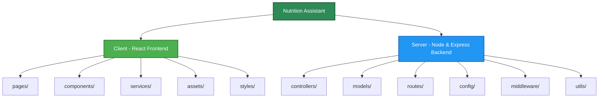

# CREATING PROJECT FOLDER

## Project Name

**Nutrition Assistant**

## Technology Stack

MERN Stack (MongoDB, Express.js, React.js, Node.js)

---

# Objective

The project folder structure establishes separate development environments for the frontend and backend of the Nutrition Assistant application. Separating the client-side interface from the server-side services improves project organization, simplifies dependency management, enhances maintainability, and enables independent development and deployment of both modules.

---

# Development Workspace Layout

### Step 1: Create Main Project Folder

Create the primary project directory that serves as the root container for the Nutrition Assistant application.

```text
Nutrition-Assistant
```

---

### Step 2: Create Client Folder (React.js Frontend)

Inside the **Nutrition-Assistant** directory, create a folder named **Client** to store the React.js application.

```text
Client
```

#### Purpose & Key Subdirectories

- **Pages** – Contains application pages such as Login, Dashboard, Meal Planner, and Profile.
- **Components** – Stores reusable UI components including Navbar, Footer, Cards, and Forms.
- **Services** – Handles API communication using Axios.
- **Assets** – Contains images, icons, fonts, and other static resources.
- **Styles** – Includes CSS files for application styling.

---

### Step 3: Create Server Folder (Node.js Backend)

Inside the **Nutrition-Assistant** directory, create a folder named **Server** to store the backend application.

```text
Server
```

#### Purpose & Key Subdirectories

- **Models** – Defines MongoDB schemas using Mongoose.
- **Controllers** – Implements application business logic and request handling.
- **Routes** – Defines REST API endpoints for frontend communication.
- **Config** – Stores MongoDB connection and application configuration.
- **Middleware** – Implements authentication and request validation.
- **Utils** – Contains helper functions and reusable utilities.

---

### Step 4: Visual Studio Code Integration

Open Visual Studio Code and load the project workspace.

**File → Open Folder → Nutrition-Assistant**

The project structure will appear as:

```text
Nutrition-Assistant/
│
├── Client/       # React.js Frontend
└── Server/       # Node.js + Express Backend
```

---

# Workspace Structure Diagram

The following diagram illustrates the folder organization of the Nutrition Assistant project.



---

# Strategic Benefits

- **Separation of Concerns** – Frontend and backend applications are maintained independently, improving code organization.
- **Independent Dependency Management** – Each module maintains its own `package.json` and libraries without conflicts.
- **Scalable Development** – New features such as nutrition tracking, meal planning, and recommendation modules can be added without affecting the existing structure.
- **Efficient Team Collaboration** – Frontend and backend developers can work simultaneously on different modules.
- **Flexible Deployment** – The React frontend can be deployed independently on platforms such as Vercel or Netlify, while the backend API can be hosted on Render, Railway, or AWS.

---

# Expected Outcome

Successfully create the initial project workspace for the **Nutrition Assistant** application with separate **Client** and **Server** directories. This structured setup provides a strong foundation for developing a scalable, maintainable, and production-ready MERN Stack application for personalized nutrition management.

---

**Project:** Nutrition Assistant

**Technology Stack:** MERN Stack (MongoDB, Express.js, React.js, Node.js)
