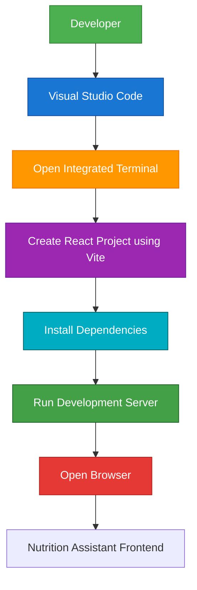

# SETTING UP CLIENT FOLDER FOR FRONTEND

## Project Name

**Nutrition Assistant – Personalized Nutrition Management System**

## Technology Stack

**React.js, Vite, JavaScript, Bootstrap, Axios (MERN Stack)**

---

# Objective

The client folder contains the frontend of the Nutrition Assistant application. It is developed using React.js with Vite, providing a fast development environment and an interactive user interface. This setup initializes the React project, installs all required dependencies, and prepares the frontend for communication with the backend APIs.

---

# Client Folder Setup

### Step 1: Open the Client Folder

Open **Visual Studio Code** and navigate to the project directory.

```text
Nutrition-Assistant
│
├── Client
└── Server
```

Open the integrated terminal and move into the Client folder.

```bash
cd Client
```

---

### Step 2: Create the React Application

Initialize a React project using Vite.

```bash
npm create vite@latest . -- --template react
```

During setup, select the following options:

**Framework**

```text
React
```

**Variant**

```text
JavaScript
```

This command generates the initial React application structure inside the Client folder.

---

### Step 3: Install Project Dependencies

Install all required npm packages.

```bash
npm install
```

This command downloads and installs all dependencies listed in the `package.json` file.

---

### Step 4: Start the Development Server

Launch the React development server.

```bash
npm run dev
```

After execution, Vite generates a local development URL similar to:

```text
http://localhost:5173/
```

Open the URL in a web browser to access the Nutrition Assistant frontend.

---

# Client Folder Structure

```text
Client/
│
├── node_modules/
├── public/
│
├── src/
│   ├── assets/
│   ├── components/
│   ├── pages/
│   ├── services/
│   ├── App.jsx
│   ├── main.jsx
│   └── index.css
│
├── package.json
├── package-lock.json
├── vite.config.js
└── index.html
```

---

# Workflow Diagram



---

# Commands Used

### Navigate to Client Folder

```bash
cd Client
```

### Create React Project

```bash
npm create vite@latest . -- --template react
```

### Install Dependencies

```bash
npm install
```

### Start Development Server

```bash
npm run dev
```

---

# Advantages

- Fast project initialization using Vite.
- Lightweight and modern React development environment.
- Hot Module Replacement (HMR) for instant updates.
- Modular project structure.
- Easy integration with Express.js backend APIs.
- Improved development performance.
- Supports scalable frontend architecture.

---

# Expected Outcome

Successfully initialize the **Client** folder with a React.js application using Vite. The frontend is configured with all required dependencies, a standard project structure, and a development server, providing a solid foundation for building the Nutrition Assistant user interface and integrating it with the backend services.

---

## Conclusion

The client setup establishes the frontend environment of the Nutrition Assistant application. By using React.js and Vite, developers can build a responsive, maintainable, and high-performance user interface while ensuring seamless communication with the backend through RESTful APIs.

---
