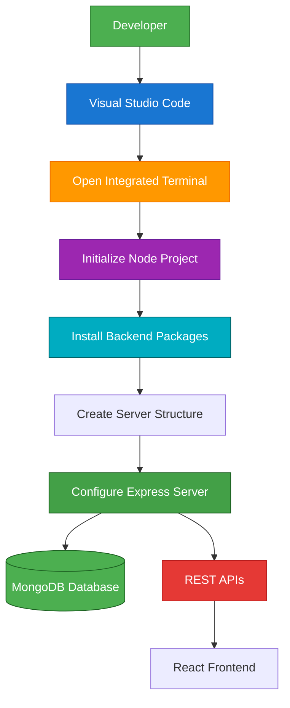

# SETTING UP SERVER FOLDER FOR BACKEND

## Project Name

**Nutrition Assistant – Personalized Nutrition Management System**

## Technology Stack

**Node.js, Express.js, MongoDB, Mongoose (MERN Stack)**

---

# Objective

The server folder contains the backend of the Nutrition Assistant application. It is responsible for handling RESTful APIs, business logic, user authentication, database operations, and communication with the MongoDB database. This setup prepares the backend environment for developing scalable and secure server-side functionalities.

---

# Server Folder Setup

### Step 1: Open the Server Folder

Open **Visual Studio Code** and navigate to the project directory.

```text
Nutrition-Assistant
│
├── Client
└── Server
```

Open the integrated terminal and move into the Server folder.

```bash
cd Server
```

---

### Step 2: Initialize the Node.js Project

Create a new Node.js project by generating the `package.json` file.

```bash
npm init -y
```

This command creates a default `package.json` file required for managing backend dependencies.

---

### Step 3: Create the Main Server File

Create the application's entry point.

```text
server.js
```

The `server.js` file initializes the Express server, connects to MongoDB, loads middleware, and starts the backend application.

---

### Step 4: Create Backend Folders

Create the following folders inside the Server directory.

```text
Server/
│
├── config/
├── controllers/
├── middleware/
├── models/
├── routes/
├── services/
├── utils/
├── server.js
├── package.json
```

#### Folder Description

**config/**

Contains database configuration and environment setup.

**controllers/**

Handles incoming HTTP requests and business logic.

**middleware/**

Stores middleware functions such as authentication and error handling.

**models/**

Contains MongoDB schemas and Mongoose models.

**routes/**

Defines REST API endpoints for different modules.

**services/**

Contains reusable business logic and utility functions.

**utils/**

Stores helper functions and common utilities.

---

### Step 5: Install Required Packages

Install the backend dependencies.

```bash
npm install express mongoose cors dotenv bcryptjs jsonwebtoken
```

Install Nodemon for development.

```bash
npm install --save-dev nodemon
```

---

### Step 6: Configure package.json

Add the following scripts.

```json
"scripts": {
  "start": "node server.js",
  "dev": "nodemon server.js"
}
```

---

### Step 7: Start the Backend Server

Run the backend server.

```bash
npm run dev
```

or

```bash
npm start
```

If everything is configured correctly, the terminal displays a message similar to:

```text
Server running on port 5000
MongoDB Connected Successfully
```

---

# Server Folder Structure

```text
Server/
│
├── config/
│     └── db.js
│
├── controllers/
│     ├── userController.js
│     ├── mealController.js
│     └── nutritionController.js
│
├── middleware/
│     ├── authMiddleware.js
│     └── errorMiddleware.js
│
├── models/
│     ├── User.js
│     ├── Meal.js
│     └── Nutrition.js
│
├── routes/
│     ├── userRoutes.js
│     ├── mealRoutes.js
│     └── nutritionRoutes.js
│
├── services/
│     └── nutritionService.js
│
├── utils/
│     └── helpers.js
│
├── server.js
├── package.json
├── package-lock.json
└── .env
```

---

# Backend Workflow Diagram



---

# Commands Used

### Navigate to Server Folder

```bash
cd Server
```

### Initialize Node.js Project

```bash
npm init -y
```

### Install Dependencies

```bash
npm install express mongoose cors dotenv bcryptjs jsonwebtoken
```

### Install Nodemon

```bash
npm install --save-dev nodemon
```

### Start Backend Server

```bash
npm run dev
```

or

```bash
npm start
```

---

# Advantages

- Organized backend architecture.
- Modular Express.js project structure.
- Secure RESTful API development.
- Easy MongoDB integration.
- JWT-based authentication support.
- Scalable and maintainable codebase.
- Simplified debugging with Nodemon.
- Clear separation of routes, controllers, and models.

---

# Expected Outcome

Successfully configure the **Server** folder for the Nutrition Assistant application using **Node.js** and **Express.js**. The backend is prepared with a standard folder structure, required dependencies, and development scripts, enabling secure API development and seamless communication with the MongoDB database.

---

## Conclusion

The server setup establishes the backend foundation of the Nutrition Assistant application. With Express.js, MongoDB, and Mongoose, the project follows a modular and scalable architecture, making it easy to develop REST APIs, implement authentication, manage nutrition data, and support future enhancements.
